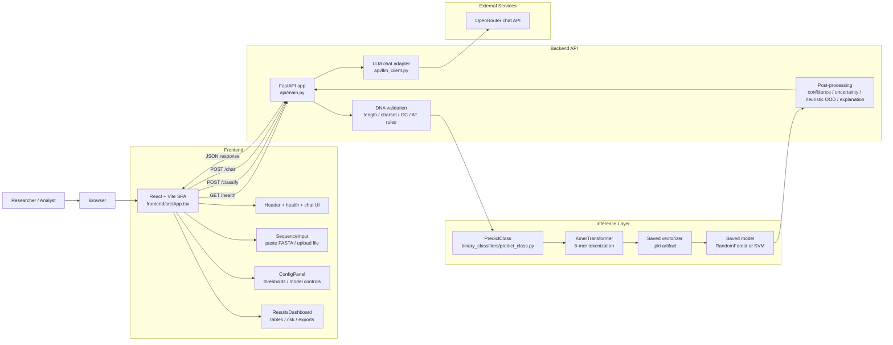
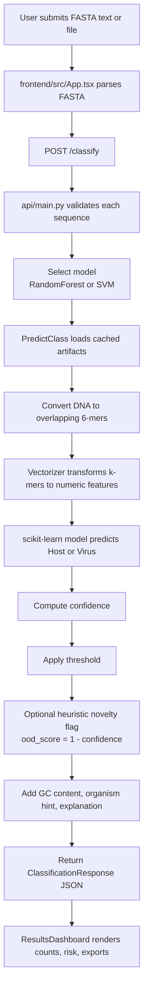
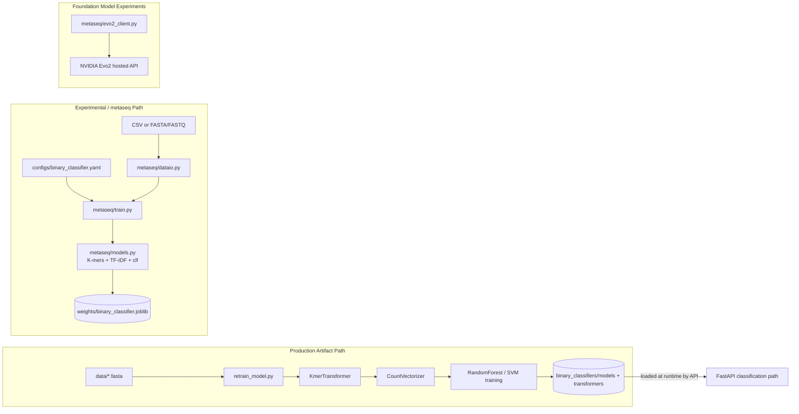
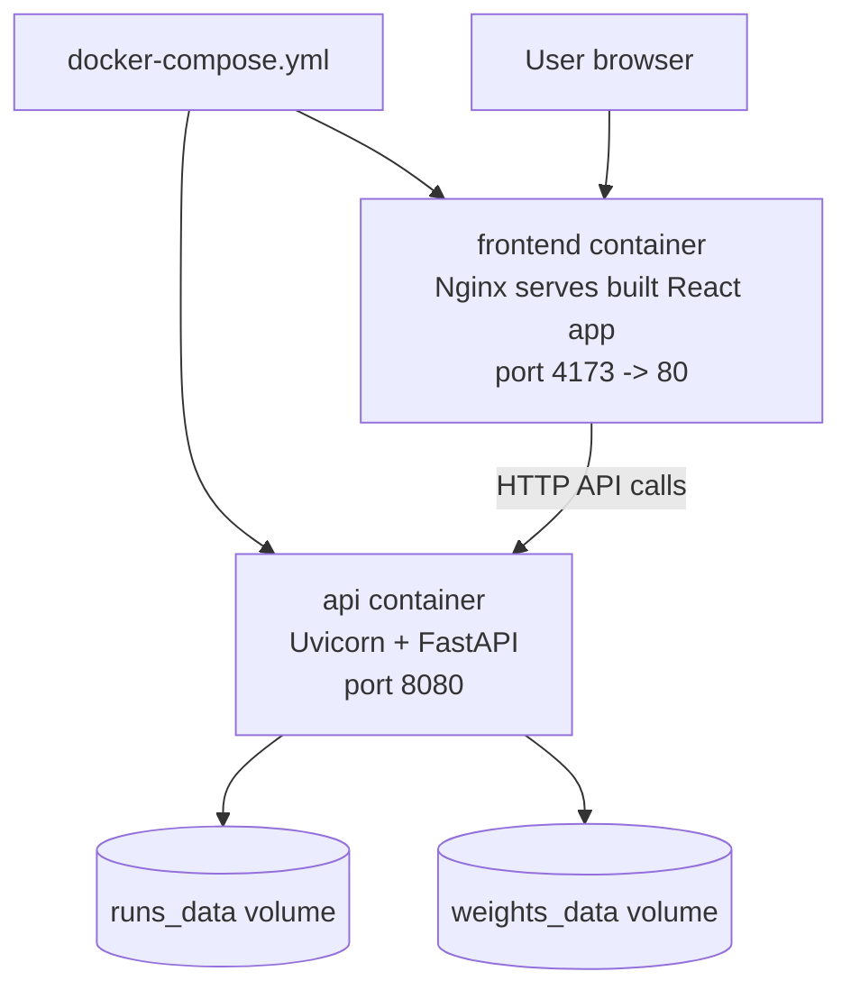

# BAIO Architecture

This document reflects the current code path in the repository, not older project descriptions. The production system today is a web app with a React frontend, a FastAPI backend, and a classical ML inference layer based on k-mer features plus saved scikit-learn models.

## 1. High-Level System Architecture

## 2. Production Classification Request Flow

## 3. Training And Research Architecture

## 4. Repository Responsibilities

| Area | Responsibility | On production request path? |
|---|---|---|
| `frontend/` | Browser UI, FASTA input, controls, chat panel, results rendering | Yes |
| `api/` | REST endpoints, validation, orchestration, chat integration | Yes |
| `binary_classifiers/` | Production inference code and saved model/vectorizer artifacts | Yes |
| `metaseq/` | Experimental training/inference utilities and Evo2 integration | No, separate research path |
| `data_processing/` | Shared parsing/validation helpers | Not used by `api/main.py` today |
| `prompting/` | General LLM prompting utilities and comparisons | Not wired into the FastAPI request flow today |
| `scripts/` | Evaluation and metrics utilities | No |
| `tests/` | Unit and integration coverage | No |

## 5. Deployment View

## 6. Presenter Notes

- BAIO is split into three layers: presentation, API orchestration, and ML inference.
- The current production classifier is classical ML, not the Evo2 research path.
- DNA flows through validation, 6-mer feature extraction, vectorization, then an SVM or RandomForest classifier.
- The "Novel" result is currently a heuristic OOD flag derived from low confidence, not a full open-set model.
- Chat is handled separately from classification through the `/chat` endpoint and an external LLM API.
- Training and experimentation are isolated from the user-facing inference path, which keeps deployment simpler.

## 7. Short Talk Track

Use this if you need a 30 to 45 second explanation:

> BAIO is organized as a three-layer system. The React frontend collects FASTA sequences and configuration from the user, then sends them to a FastAPI backend. The backend validates each DNA sequence and calls the production classifier, which converts sequences into 6-mers, vectorizes them, and runs a saved RandomForest or SVM model. The backend then adds confidence, uncertainty, and a heuristic novelty flag before returning the results to the dashboard. Separately, the repository also contains retraining scripts and a `metaseq` research pipeline for future models such as Evo2, but those are not the main production inference path today.
