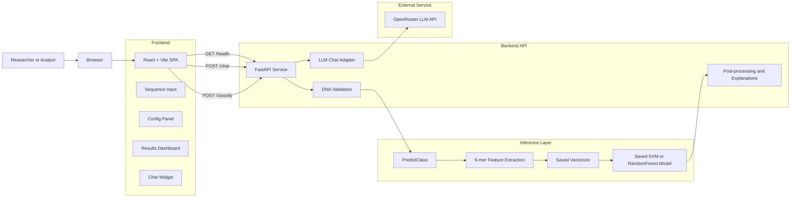
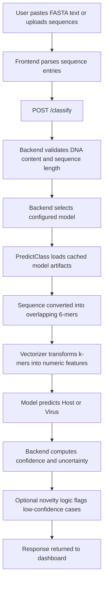

# Artifact Checkpoint Submission

## Selected Checkpoint Catalog Item
**System Architecture / Technical Design Documentation**

If your course catalog uses slightly different wording for this checkpoint, replace only the line above with the exact catalog title.

## Primary Artifact
**BAIO Current-System Architecture Snapshot**

Artifact format: Markdown document

## Rationale
At this point in the semester, BAIO has enough real implementation across the frontend, backend, and machine learning layers that an architecture checkpoint is more useful than a generic planning exercise. The repository already contains a working React/Vite interface, a FastAPI service, saved classification artifacts, and an experimental research path for future model work. Capturing the current architecture now is meaningful because it turns that implementation into a shared technical reference before the team adds more complexity through database integration, model refinement, and end-to-end workflow expansion.

This checkpoint also directly supports the final product and the community strategy. For the final product, a current architecture artifact reduces integration risk by clarifying which code paths are production-critical and how requests move through the system. For the project community, it improves onboarding and contributor alignment by showing where new contributors can work safely, how the major components connect, and which parts of the repository are user-facing versus experimental. In an open-source setting, that kind of documentation is part of the product because it makes collaboration sustainable.

## Artifact Summary
BAIO is a web-based metagenomic analysis platform for DNA sequence classification and novelty-aware pathogen screening. The current production path uses a React frontend, a FastAPI backend, and classical machine learning inference based on 6-mer sequence features with saved scikit-learn models. The repository also includes a separate research pipeline for future training and Evo2-based experimentation.

This artifact documents the implemented architecture reflected in the current repository state, with emphasis on the production request flow and repository responsibilities that matter for the team's next milestone.

## High-Level Architecture

## Production Classification Flow

## Current Implementation Evidence
- `frontend/src/App.tsx` coordinates the main user workflow: sequence parsing, health checks, classification requests, result storage in local state, dark mode, and chat interactions.
- `api/main.py` exposes the current service endpoints, including `/health`, `/classify`, `/chat`, `/run_pipeline`, and `/reload_models`.
- `api/main.py` also performs sequence validation, confidence handling, explanation generation, and response assembly.
- `binary_classifiers/predict_class.py` loads the saved classification artifacts and routes requests through either the classical k-mer pipeline or the Evo2 fallback path.
- `binary_classifiers/models/` and `binary_classifiers/transformers/` store the production model and vectorizer artifacts used at inference time.
- `docs/MILESTONE_2.md` confirms that the project is currently focused on UI improvement, infrastructure expansion, model refinement, and stronger end-to-end integration.

## Repository Responsibilities
| Area | Current responsibility | Production path |
|---|---|---|
| `frontend/` | User interface, FASTA input, controls, visual results, chat UI | Yes |
| `api/` | Request validation, orchestration, chat integration, response formatting | Yes |
| `binary_classifiers/` | Production model loading, preprocessing, prediction, saved artifacts | Yes |
| `metaseq/` | Experimental training and Evo2 research workflow | No |
| `scripts/` | Evaluation and metrics utilities | No |
| `tests/` | Unit and integration validation | No |

## Why This Checkpoint Matters Now
- The team is moving from isolated implementation work toward tighter system integration.
- Frontend, API, and model work are already active, which makes interface clarity more important than another abstract plan.
- Database support and additional workflow complexity will be easier to add once the current production path is documented.
- A documented architecture gives contributors a shared mental model, which lowers onboarding cost and improves review quality.

## Contribution To Final Product
- Clarifies the user-facing path from sequence input to classification output.
- Distinguishes the production classifier from experimental research code.
- Creates a reference for future database integration and API expansion.
- Supports milestone execution by making component boundaries and dependencies explicit.

## Contribution To Community Strategy
- Makes the repository easier for new contributors to understand quickly.
- Improves contributor confidence by identifying which modules are safe entry points for documentation, frontend, backend, testing, or ML work.
- Reduces repeated explanation overhead for maintainers during onboarding and code review.
- Strengthens project transparency, which is especially valuable for an open-source academic team project.

## Submission Note
This Markdown document is the primary fixed-format artifact for the checkpoint submission. If multiple files are allowed, the team may optionally submit this file together with `docs/design.md` as supporting evidence of the same checkpoint work.
