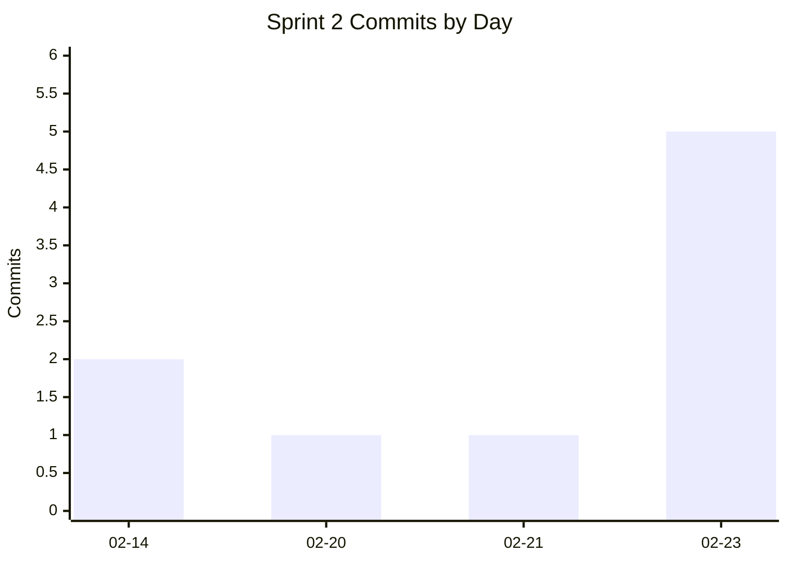
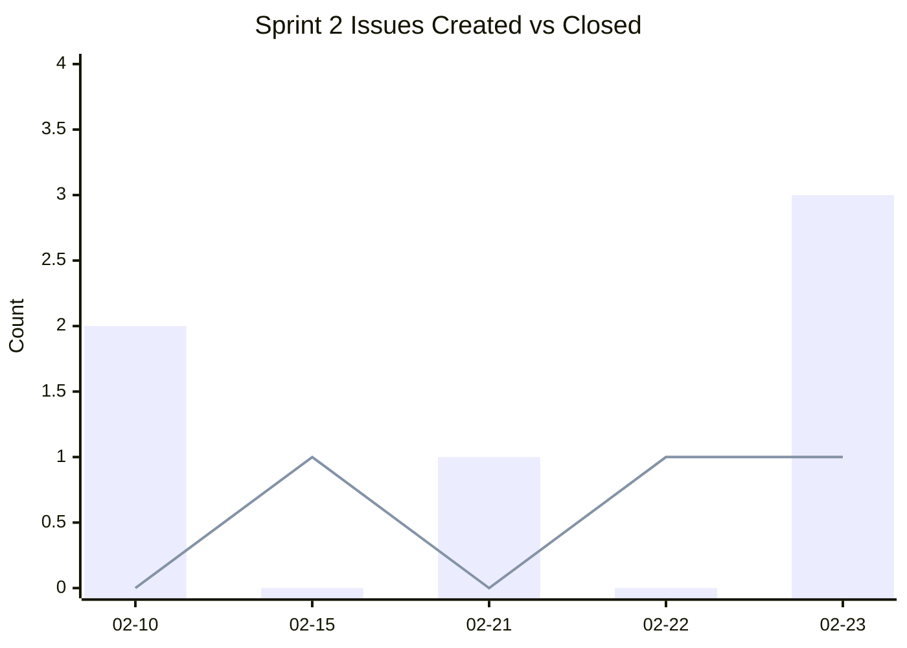
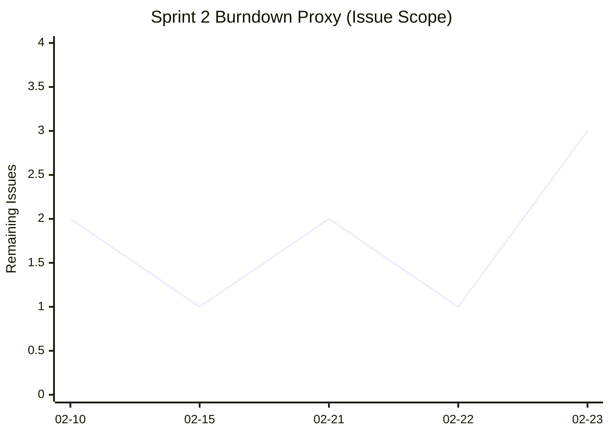

# Tech Lead Metrics Report

## Sprint Info
- Sprint: `2`
- Reporting window: `2026-02-10` to `2026-02-23`
- Report type: baseline (first metrics report)
- Data artifact: `runs/metrics/sprint_2_baseline.json`

## 1) Metrics Selection
We tracked metrics that directly reflect sprint delivery, execution flow, and engineering quality.

1. Velocity
- `9` commits
- `9` merged PRs
- `3` closed issues

2. WIP
- `1` open PR (current)
- `4` open issues (current)

3. Goal Achievement
- `issues_closed / issues_created = 3 / 6 = 50.0%`

4. Defect Rate
- `0` new issues labeled `bug` during the sprint

5. Quality Baseline
- `62/62` tests passed (`100.0%` pass rate)

6. Flow Efficiency
- PR cycle time (create -> merge):
  - median `4.2h`
  - mean `60.76h`
  - min `0.13h`, max `269.74h`

Why these align with team goals:
- We need predictable delivery (velocity + goal achievement).
- We need to avoid overload (WIP).
- We need confidence in merges (tests + defect rate).
- We need faster review/merge flow (cycle time).

## 2) Baseline Establishment

### Baseline Values
| Metric | Baseline (Sprint 2) | Data Source |
|---|---:|---|
| Commits | 9 | git log |
| Contributors | 2 | git log |
| Lines added / deleted | 2019 / 434 | git numstat |
| Net code churn | +1585 lines | git numstat |
| Unique files changed | 17 | git numstat |
| Issues created | 6 | GitHub Search API |
| Issues closed | 3 | GitHub Search API |
| Goal achievement | 50.0% | Derived |
| PRs created / merged | 12 / 9 | GitHub Search API |
| PR merge rate | 75.0% | Derived |
| Open PRs (snapshot) | 1 | GitHub Search API |
| Open issues (snapshot) | 4 | GitHub Search API |
| New bug issues | 0 | GitHub Search API |
| Tests passed | 62/62 | pytest |
| Test pass rate | 100.0% | Derived |

### Visualization: Commit Activity

### Visualization: Issue Intake vs Closures

### Visualization: Burndown (Remaining Work Proxy)
Remaining = cumulative created - cumulative closed

## 3) Baseline Analysis
Since this is the first report, no prior sprint trend exists yet. Baseline insights:

- Delivery was active late in sprint:
  - `5/9` commits happened on `2026-02-23`.
- Throughput was decent (`9` merged PRs), but issue completion lagged (`50%`).
- PR flow is uneven:
  - median merge time is fast (`4.2h`), but max is very high (`269.74h`), suggesting a few very old PRs skewing cycle time.
- Test baseline is strong (`100%` pass rate on `62` tests).
- Burndown proxy increased at sprint end (remaining issues `1 -> 3`) because new scope was added late.

What surprised us:
- High PR merge count with only moderate issue closure indicates PR/issue mapping is inconsistent or work was not tracked strictly through issues.

Important context missing from numbers:
- No story points yet, so velocity is a proxy (commits/PRs/issues), not effort-normalized velocity.
- No explicit blocked label usage, so blocked-work metric is under-instrumented.
- No team/client sentiment instrument yet.

## 4) Action Items for Next Sprint
1. Improve sprint goal completion:
- Target `>= 80%` issue completion (`closed/created`).
- Freeze sprint scope after day 3 unless urgent.

2. Reduce flow outliers:
- Keep PR median cycle time `< 24h`.
- No PR older than `72h` without explicit blocker note.

3. Tighten WIP discipline:
- Keep open PRs `<= 2` per active contributor.

4. Improve metric quality:
- Require issue linking in PR descriptions.
- Add and use a `blocked` label consistently.

5. Add one missing quality metric:
- Install and report code coverage (`pytest-cov`) next sprint.

How we will know changes worked:
- Compare Sprint 3 against this baseline on:
  - completion rate
  - PR median/max cycle time
  - WIP snapshot
  - coverage percentage (new)

## 5) Process Reflection
- Data collection difficulty: moderate.
  - Git and pytest were straightforward.
  - GitHub metrics required API queries and auth.
- Most valuable metrics:
  - goal achievement, PR cycle time, WIP
- Least valuable (current form):
  - raw commit count alone (easy to game, weak effort signal)
- What we would track differently next time:
  - add story points and planned-vs-delivered scope by issue labels/milestones
  - add a quick team satisfaction pulse (1-5 at retro)
  - include client demo feedback score

